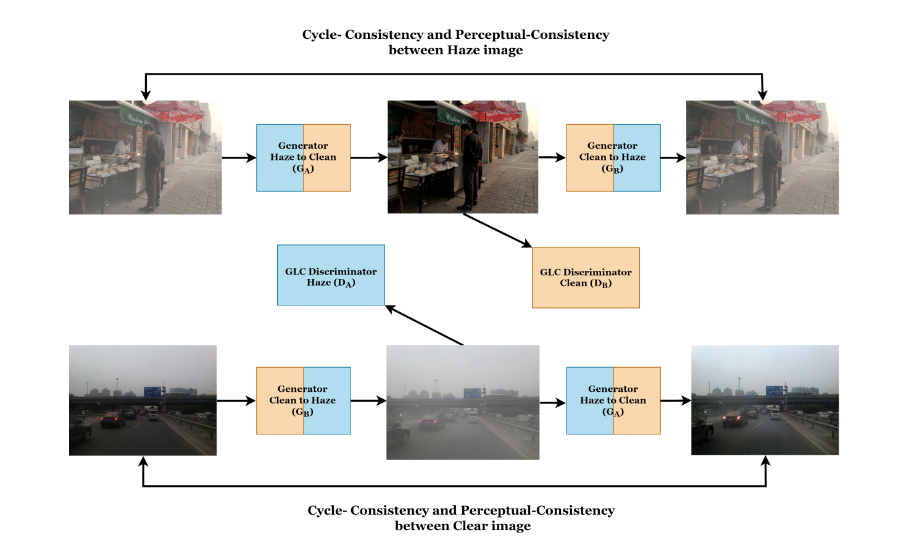
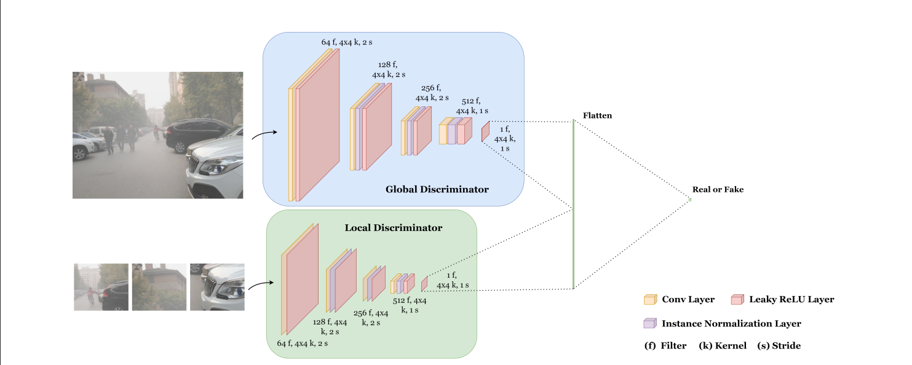
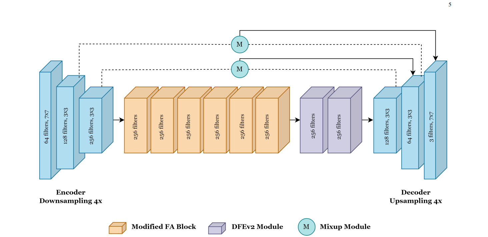

# AGLC-GAN
AGLC-GAN: Attention-based Global-Local Cycle-consistent Generative Adversarial Networks for Unpaired Single Image Dehazing.

Python notebook containing Pytorch implementation of AGLC-GAN.

## Model Architecture

## Dependencies

- Python 3
- PyTorch >= 1.0
- NVIDIA GPU+CUDA
